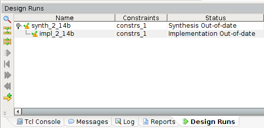
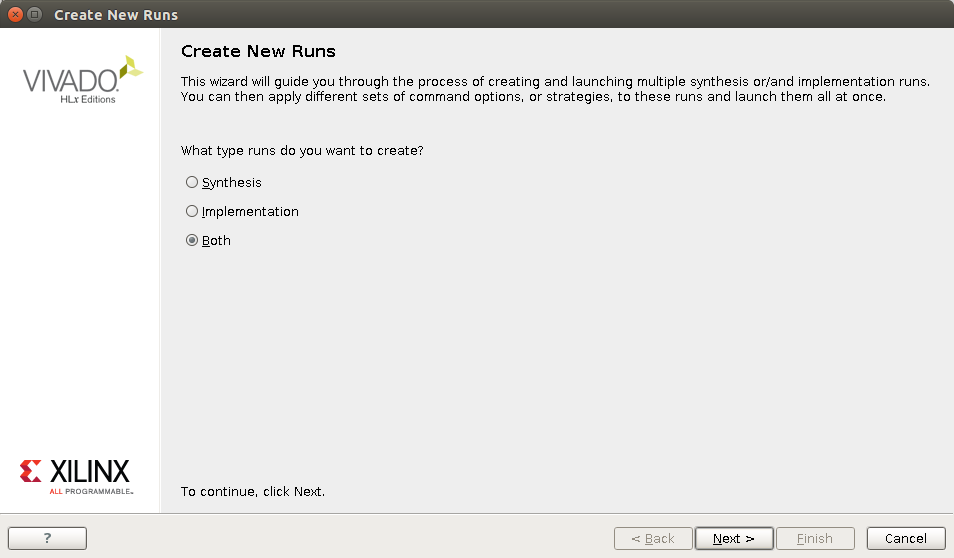
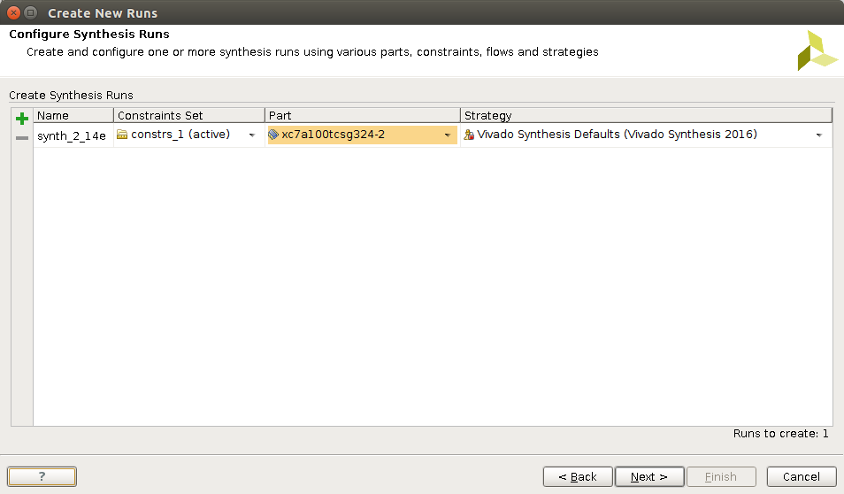
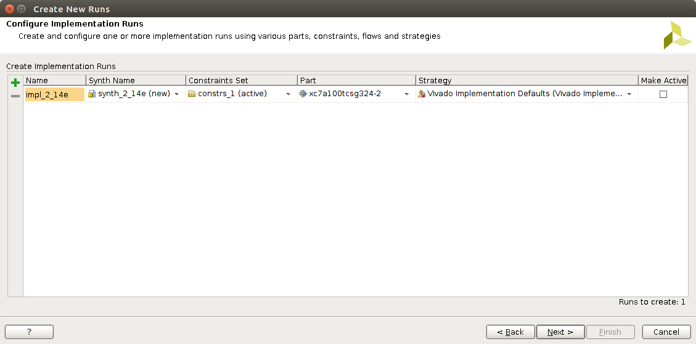

# Demo
This directory contains many example projects to demonstate and/or test various components
include in the ZTEX's fpga board. These project are tested on USB-FPGA Module 2.14b. Althrough, 
they should work on other variants of the USB-FPGA Module 2.14 by create an additional "Design Runs".

## Vivado's project setting for different variants of ZTEX's board
1. Create a "Design Runs" for the variant of ZTEX's board you have by click on the plus arrow
on the left hand side of the "Design Runs" panel.

    

2. Choose "Both" to create run for synthesis and implementation

    

3. Name your synthesis design run forexample if you have the USB-FPGA Module 2.14e, 
you should name the run as "synth_2_14_e".   

    

4. Name your implementation design run forexample if you have the USB-FPGA Module 2.14e, 
you should name the run as "impl_2_14_e". 

    

The result bit stream file will be stored at fpga-2.14/(project name).runs/impl_2_14_e/(project name).bit
which is the default path used by the java console application provided. 

The java console application will automatically determine the variant of the board connect to your PC and
select the appropriate bit stream file for that variant given that it is stored in a default location.